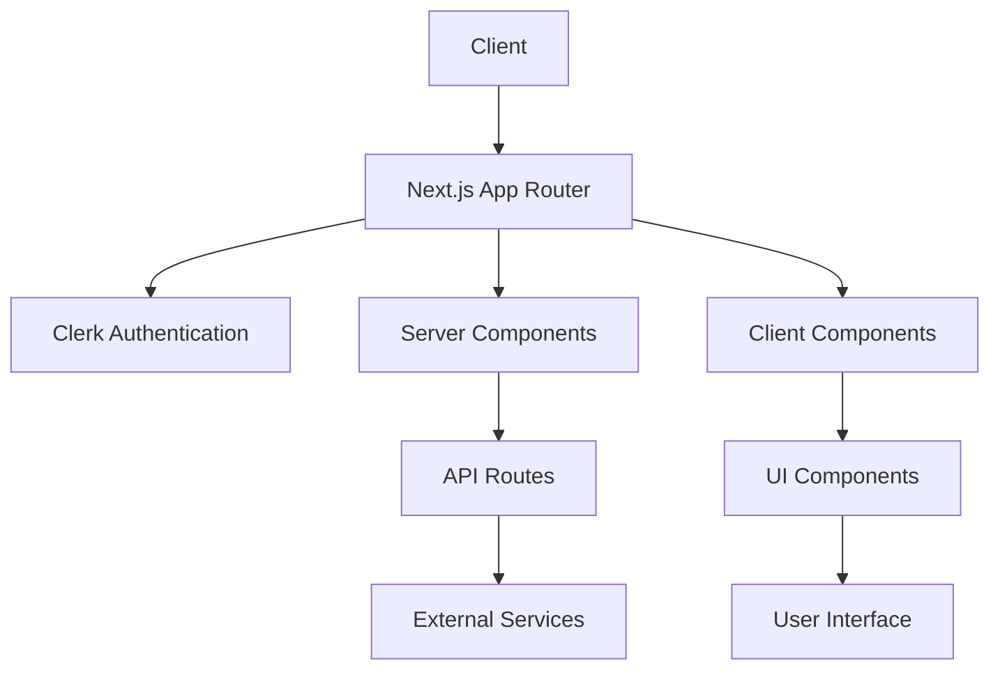
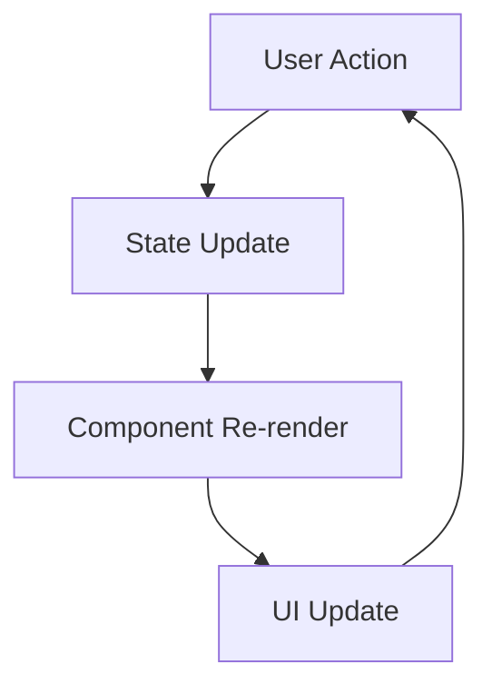
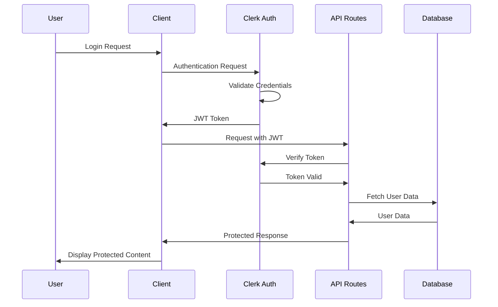
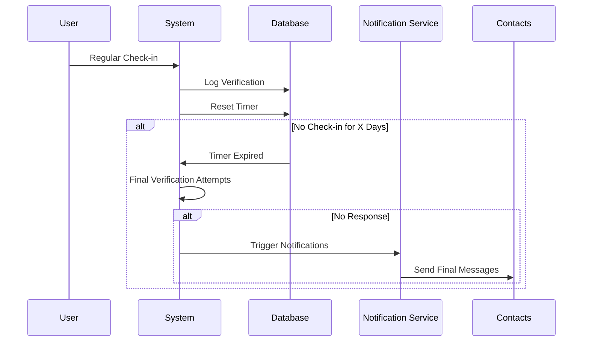
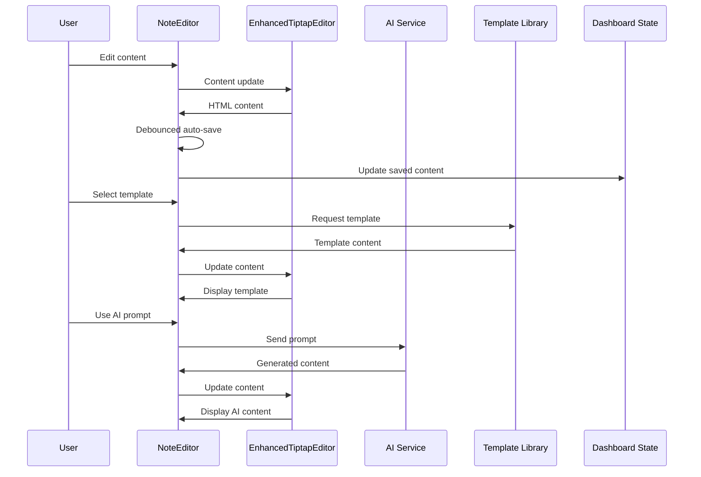

# Death Note: Digital Legacy Management

<div align="center">
  
</div>

Death Note is a secure digital legacy management platform that enables users to create and store messages that will be delivered to their designated contacts only when they're no longer able to verify their status. Using a sophisticated proof-of-life verification system, the application ensures your final messages remain private until the appropriate time.


## 📑 Table of Contents

- [Features](#-features)
- [Architecture](#-architecture)
- [Data Flow](#-data-flow)
- [Tech Stack](#-tech-stack)
- [Project Structure](#-project-structure)
- [Getting Started](#-getting-started)
- [Environment Variables](#-environment-variables)
- [Authentication](#-authentication)
- [Components](#-components)
- [Editor Architecture](#-editor-architecture)
- [API Endpoints](#-api-endpoints)
- [Contributing](#-contributing)
- [Security](#-security)
- [License](#-license)
- [Recent Updates](#-recent-updates)

## 🌟 Features

- **Secure Message Creation**: Craft detailed final messages with a full-featured rich text editor
- **Automated Verification System**: Regular check-ins ensure your messages remain private
- **Contact Management**: Designate and manage trusted recipients for your messages
- **Theme Options**: Light, Dark, and "Shinigami" modes for personalized user experience
- **Verification History**: Track all past check-ins and verifications
- **Premium Features**: Extended verification periods, unlimited contacts, and custom notifications
- **Responsive Design**: Seamless experience across desktop and mobile devices
- **End-to-End Encryption**: Your sensitive data is always protected

## 🏗 Architecture

The Death Note application uses a modern, component-based architecture built on Next.js App Router with a focus on server components where possible and client components where interactivity is needed.



### Core Module Structure

```
┌─────────────────────┐      ┌─────────────────────┐      ┌─────────────────────┐
│                     │      │                     │      │                     │
│  Authentication     │─────▶│     Dashboard       │─────▶│  Message Editor     │
│                     │      │                     │      │                     │
└─────────────────────┘      └─────────────────────┘      └─────────────────────┘
          │                            │                            │
          │                            │                            │
          ▼                            ▼                            ▼
┌─────────────────────┐      ┌─────────────────────┐      ┌─────────────────────┐
│                     │      │                     │      │                     │
│   User Settings     │      │ Verification System │      │  Contact Manager    │
│                     │      │                     │      │                     │
└─────────────────────┘      └─────────────────────┘      └─────────────────────┘
```

## 🔄 Data Flow

The application follows a unidirectional data flow pattern:



### Authentication Flow



### Verification System



## 🛠 Tech Stack

- **Frontend**:
  - Next.js 15.3.2
  - React 19.0.0
  - TypeScript 5.0+
  - Tailwind CSS 4.0
  - Framer Motion 12.11.0
  - Shadcn UI Components

- **Authentication**:
  - Clerk Authentication

- **Rich Text Editing**:
  - TipTap Editor

- **State Management**:
  - React Hooks
  - Context API

- **Data Visualization**:
  - Recharts

- **Form Handling**:
  - React Hook Form
  - Zod Validation

## 📁 Project Structure

```
/src
  /app                     # Next.js App Router
    /(auth)                # Protected routes
      /dashboard           # Main dashboard
      /editor              # Message editor
      /contacts            # Contact management
      /verification        # Verification history
      /settings            # User settings
    /api                   # API routes
    /sign-in               # Authentication pages
    /sign-up
  /components              # Reusable components
    /ui                    # UI components (Shadcn)
    /icons                 # SVG icons and logos
    /editor                # Editor components
  /lib                     # Utility functions
    /editor                # Editor-specific utilities
  /hooks                   # Custom React hooks
  /types                   # TypeScript type definitions
  /styles                  # Global styles and themes
```

## 🚀 Getting Started

### Prerequisites

- Node.js 18.0 or later
- npm or yarn package manager
- Git

### Installation

1. Clone the repository:
   ```bash
   git clone https://github.com/8bittts/deathnote.git
   cd deathnote
   ```

2. Install dependencies:
   ```bash
   npm install
   # or
   yarn install
   ```

3. Set up environment variables:
   ```bash
   cp .env.example .env.local
   # Then edit .env.local with your API keys
   ```

4. Run the development server:
   ```bash
   npm run dev
   # or
   yarn dev
   ```

5. Open [http://localhost:4321](http://localhost:4321) in your browser to view the application.

### Building for Production

```bash
npm run build
npm run start
# or
yarn build
yarn start
```

## 🔐 Environment Variables

| Variable | Description | Required |
|----------|-------------|----------|
| `NEXT_PUBLIC_CLERK_PUBLISHABLE_KEY` | Clerk public API key | Yes |
| `CLERK_SECRET_KEY` | Clerk secret API key | Yes |
| `NEXT_PUBLIC_CLERK_SIGN_IN_URL` | Clerk sign-in URL path | Yes |
| `NEXT_PUBLIC_CLERK_SIGN_UP_URL` | Clerk sign-up URL path | Yes |
| `NEXT_PUBLIC_CLERK_AFTER_SIGN_IN_URL` | Redirect URL after sign-in | Yes |
| `NEXT_PUBLIC_VERIFICATION_PERIOD_DAYS` | Default verification period (days) | No (default: 7) |
| `NEXT_PUBLIC_APP_URL` | Application URL for callbacks | Yes |
| `NEXT_PUBLIC_DEEPSEEK_API_KEY` | API key for DeepSeek AI service | No |
| `NEXT_PUBLIC_FIRECRAWL_API_KEY` | API key for FireCrawl web extraction service | No |

See `.env.example` for a template of required environment variables.

## 🔑 Authentication

Death Note uses Clerk for authentication, providing:

- Email/password authentication
- Social login options
- Two-factor authentication
- Session management
- User profile management

Authentication is handled through middleware that protects all routes within the `(auth)` folder.

## 🧩 Components

The application uses a combination of custom components and Shadcn UI components, styled with Tailwind CSS.

### Key Custom Components

| Component | Description | Location |
|-----------|-------------|----------|
| `NoteEditor` | Rich text editor wrapper with auto-save | `src/components/editor/note-editor.tsx` |
| `EnhancedTiptapEditor` | Underlying TipTap editor implementation | `src/components/enhanced-tiptap-editor.tsx` |
| `DeathNoteLogo` | Application logo with animation | `src/components/icons/death-note-logo.tsx` |
| `AppHeader` | Main navigation header | `src/components/app-header.tsx` |
| `ThemeToggle` | Theme switcher component | `src/components/theme-toggle.tsx` |
| `VerificationHistory` | History of check-ins | `src/components/verification-history.tsx` |
| `TemplateCombobox` | Template selector for the editor | `src/components/template-combobox.tsx` |

## 📝 Editor Architecture

The editor system in Death Note is built with a modular architecture that separates concerns:

### Editor Component Hierarchy

```
┌─────────────────────┐
│                     │
│    NoteEditor       │ Wrapper with auto-save and status indicators
│                     │
└─────────────────────┘
          │
          ▼
┌─────────────────────┐
│                     │
│ EnhancedTiptapEditor │ Formatting toolbar and content editing
│                     │
└─────────────────────┘
          │
          ▼
┌─────────────────────┐
│                     │
│   TipTap Core       │ Low-level editor engine
│                     │
└─────────────────────┘
```

### Editor Features

- **Rich Text Formatting**: Headings, lists, text alignment, links, and more
- **Template System**: Choose from predefined templates for common use cases
- **Markdown Support**: Write using Markdown syntax for faster formatting
- **Auto-Save**: Content is automatically saved as you type
- **Status Indicators**: Clear visual feedback about the save status with color-coded badges
- **AI-Powered Assistance**: Generate content using the integrated AI service

### Editor Data Flow



## 📡 API Endpoints

| Endpoint | Method | Description |
|----------|--------|-------------|
| `/api/deepseek` | POST | AI-powered message generation service |
| `/api/firecrawl` | POST | Web content extraction for inspiration |

### `/api/deepseek`

**Purpose**: Generate AI-assisted content for legacy messages.

**Request Format**:
```json
{
  "prompt": "Your message prompt or context"
}
```

**Response Format**:
```json
{
  "content": "Generated message content"
}
```

**Status Codes**:
- `200 OK`: Content successfully generated
- `400 Bad Request`: Missing or invalid parameters
- `500 Internal Server Error`: Server-side error

### `/api/firecrawl`

**Purpose**: Extract content from web URLs for inspiration or reference.

**Request Format**:
```json
{
  "url": "https://example.com/some-article"
}
```

**Response Format**:
```json
{
  "content": "Extracted content from the URL"
}
```

**Status Codes**:
- `200 OK`: Content successfully extracted
- `400 Bad Request`: Missing or invalid URL
- `500 Internal Server Error`: Server-side error

## 🤝 Contributing

We welcome contributions to Death Note! See our [CONTRIBUTING.md](CONTRIBUTING.md) for details on how to get started.

### Development Workflow

1. Fork the repository
2. Create a feature branch
3. Make your changes
4. Run tests
5. Submit a pull request

## 🔒 Security

Death Note takes security seriously:

- All user data is encrypted
- Authentication is handled securely via Clerk
- Regular security audits
- Expiry message system with multiple verification attempts
- No storage of sensitive data in client-side code

## 📄 License

This project is licensed under the MIT License - see the [LICENSE](LICENSE) file for details.

## 🔄 Recent Updates

### Editor System Refactoring (May 2025)

The editor system has been refactored to improve maintainability and user experience:

- **Component Architecture**: Introduced a dedicated `NoteEditor` component that wraps the TipTap editor
- **Auto-save Functionality**: Added seamless background saving with visual indicators
- **Status Badges**: Added color-coded badges to show the current save status (saving/saved/error)
- **Centralized Templates**: Moved templates to a central library for better organization
- **Enhanced Documentation**: Added comprehensive JSDoc comments for all editor components
- **Type Safety**: Improved TypeScript interfaces and declarations for better type checking
- **Performance Optimization**: Reduced unnecessary re-renders with proper state management

### UI Improvements (May 2025)

- **Simplified Interface**: Streamlined the editing experience with a cleaner UI
- **Template Selection**: Enhanced the template picker with better organization
- **Mobile Responsiveness**: Improved the editor experience on smaller screens
- **Advanced Editing Tools**: Added a toggle for advanced formatting options

---

<div align="center">
  <p><strong>Death Note</strong> - Secure your digital legacy</p>
  <p>Created by <a href="https://github.com/8bittts">8bittts</a></p>
</div>  
